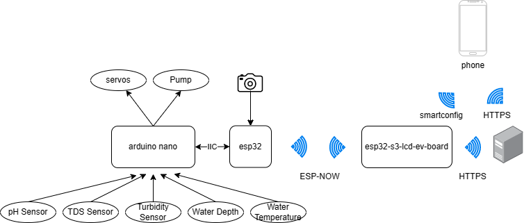
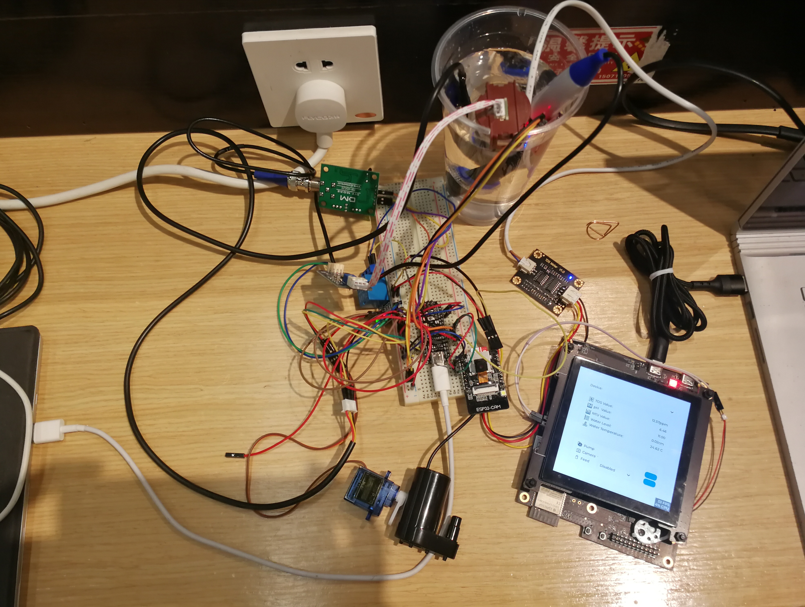
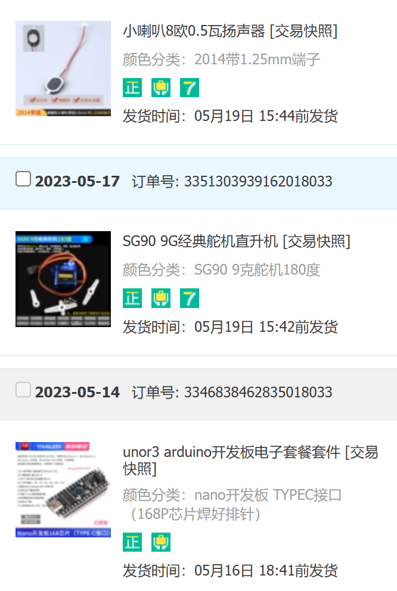
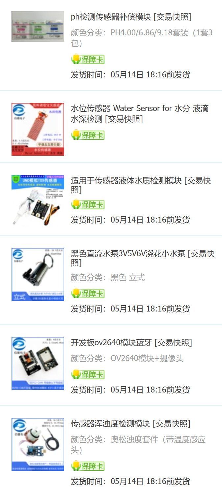
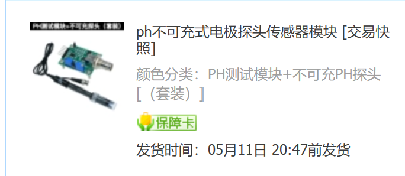

Out(rk9/14)😭

# ESP32 智能水产养殖监测系统 (物联网竞赛技术报告)

## 系统模块简介
### 水质理化性质传感器
使用传感器对水位、水温、pH值、浊度、电导率五个参量进行测量。

### 舵机与水泵
使用`SG90`舵机和由继电器控制的小水泵分别喂食和补充溶解氧。

### OV2640 摄像头
将`ESP32-CAM`搭载的`OV2640`摄像头置于水中以实时监测水下的具体情况，与各传感器实现功能互补。

### Arduino Nano
使用`Arduino Nano`的模拟输入功能，通过I$^2$C协议向`ESP32-CAM`发送数据。

### ESP32-CAM
在`ESP32-CAM`与`esp32 s3 lcd ev board`同时连接至`SEU-WLAN`情况下，将`Arduino Nano`发送的数据通过`ESP-NOW`协议传至`esp32 s3 lcd ev board`。另外，在`ESP32-CAM`与服务器间使用`ESP-NOW`发送多个包将`OV2640`摄像头采集的图像传至`esp32 s3 lcd ev board`，如果插入TF卡，则同时存入TF卡中。

### esp32 s3 lcd ev board
通过`lv_qrcode`在其搭载的显示屏展示数据，同时将数据通过http通信传值服务器。为实现人机交互功能，使用`led_strip`驱动板上LED灯表示事件，通过触屏控制舵机和水泵的开关，通过`esp-sr`添加语音识别功能，使用`esp-sntp`进行时间同步功能，使用`audio_decoder`进行提示音音频播放，同时使用`lvgl`与`esp_jpeg`进行图像展示。

### 服务器
从与`esp32 s3 lcd ev board`分别接收到数据后，可从`esp32 s3 lcd ev board`接收到的数据写入csv文件中，此时手机端可从一个网页接收数据[(示例网页)](rabbyte.xyz/aquaculture.csv)。

### 用户端
管理员可在用户端实时查看或抽样监测养殖水域的理化性质和水下实际情况，同时用户端可通过`ESP-NOW`将传感器数据接收至`esp32 s3 lcd ev board`。

### 网络拓扑图

### 实物连接图

### 元件列表

## 系统工作流程
### 数据采集
各个传感器与采集水体性质，`OV2640`摄像头监测水下、水面具体情况信息。

### 数据处理与传输
传感器采集的数据传至`Arduino Nano`，其模拟输入功能可将采集传感器传回的模拟量，并通过I$^2$C协议发送给`ESP32-CAM`，在`ESP32-CAM`与服务器间之间使用`ESP-NOW`发送多个包将摄像头采集的图像传至服务器。

### 数据输出与人机交互
`Arduino Nano`将转换后的数据通过I$^2$C协议传至`ESP32-CAM`，该设备一面将摄像头采集的数据传至显示端，一面将传感器数据传至`esp32 s3 lcd ev board`，通过搭载至主开发板上的`Submodule 2`显示屏模块输出数据，同时利用显示屏的触屏功能控制舵机和水泵的开关,最终实现对水产养殖区水域的实时监测与控制。主机数据在联网的情况下定时发送至服务器，服务器将数据写入csv文件中。

## 开发环境
`esp-idf`: v5.0.2

`SquareLine Studio`: 1.3.0

`Arduino IDE`: 2.1.0

其余`component`版本请见工程文件中

## 开发日志
### Stage 1
#### esp32 s3 lcd ev board
- 使用`SquareLine Studio`进行UI设计，并导出工程在`ui_event.c`中实现相关事件。
- 添加了主页面，通过一个下拉框选择设备，设备名称由MAC地址标识。其下方两个面板，分别为数据输出与水泵控制。
- 当接收到新的`ESP-NOW`广播信号后更新下拉框，并更新数据输出面板。

#### esp32 从设备
- 从设备使用搭载`esp32-s`模块的`ESP32-CAM`开发板，
- 使用`ESP-NOW`协议广播传感器数据，并接收主设备的指令，控制LED灯与水泵。
- (开发时把5V输入到3V3上，导致开发板烧毁，开发被迫延滞了两天)

#### Arduino Nano
- 在开发时发现，`ESP32-CAM`开发板所搭载具有ADC功能的端口均为`ADC2`，无法与使用WIFI模块的`ESP-NOW`协议兼容，所以增加了一个`Arduino`开发板，用于读取传感器数据，并通过I$^2$C协议发送给`ESP32-CAM`开发板，也同时接受开关水泵的信息。
- 传感器中`DS18B20`为`OneWire`协议，水泵使用继电器控制，其余数传感器均为模拟输出，数据经过处理与变换后即可使用。
  
### Stage 2
#### esp32 s3 lcd ev board
- 分别试用`wifi-dpp`,`blufi`与`smartconfig`三种协议，而由于`wifi-dpp`支持设备较少，`blufi`使用蓝牙时造成内存开销过大，最后选用`smartconfig`
- 使用`https_mbedtls` [protocols/https_request](https://github.com/espressif/esp-idf/tree/54576b7528/examples/protocols/https_request) 进行https通信，并且要在config中将其内存分别改为在PSRAM中进行
- 分析`SEU-WLAN`连接逻辑，实现连接校园网的功能
- 使用`lv_qrcode`进行信息展示

#### 服务器
- 编写php页面处理GET请求，并将数据存入csv文件中

### Stage 3
#### esp32 s3 lcd ev board
- 通过`ESP-NOW`协议接收摄像头数据
- 使用`lvgl`与`esp_jpeg`进行图片展示

#### esp32 从设备
- 由于采购开发板无法使用`esp-idf`刷入，故将工程迁移至`Arduino`项目(后通过降低电脑`CH340`芯片驱动版本解决，换回`esp-idf`)
- 将`OV2640`摄制信息通过`ESP-NOW`拆成数个不大于$240$字节的包分别发至主设备，主设备将其拼接后显示。

### Stage 4
#### esp32 s3 lcd ev board
- 通过`esp-sr`添加语音识别功能
- 使用`esp-sntp`进行时间同步功能
- 使用`audio_decoder`进行提示音音频播放，文件通过`spiffs`文件系统存储
- 使用`led_strip`驱动板上`WS2812` LED灯表示事件

## 可能缺陷
- `ESP-NOW`协议在网络频段拥挤的时候丢包情况严重(可通过切换信道改善，但由于`ESP-NOW`协议与AP应该一致，所以产品落实较困难)
- `lvgl`未经精简，运行开销较大
- `OV2640`模块过热造成无图像输出
- `esp-sr`会占用较多内存，而可能是不是内存超限，发生无法识别音频、显示屏错位等情况

#### esp32 从设备
- 通过`SDMMC`增加向TF卡写入图片的功能(注意只能使用单总线模式，因为有两个端口已被I$^2$C占用)

## 附件
`host_panel_src.zip`: `esp32 s3 lcd ev board`的`esp-idf`工程文件

`host_panel_design.zip`: `esp32 s3 lcd ev board`的`SquareLine Studio`工程文件

`slave_hub_src.zip`: `ESP32-CAM`的`esp-idf`工程文件

`sensor_hub_src.zip`: `Arduino Nano`的`Arduino`工程文件
